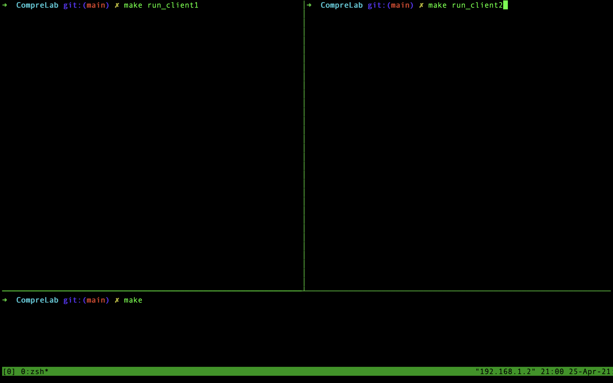
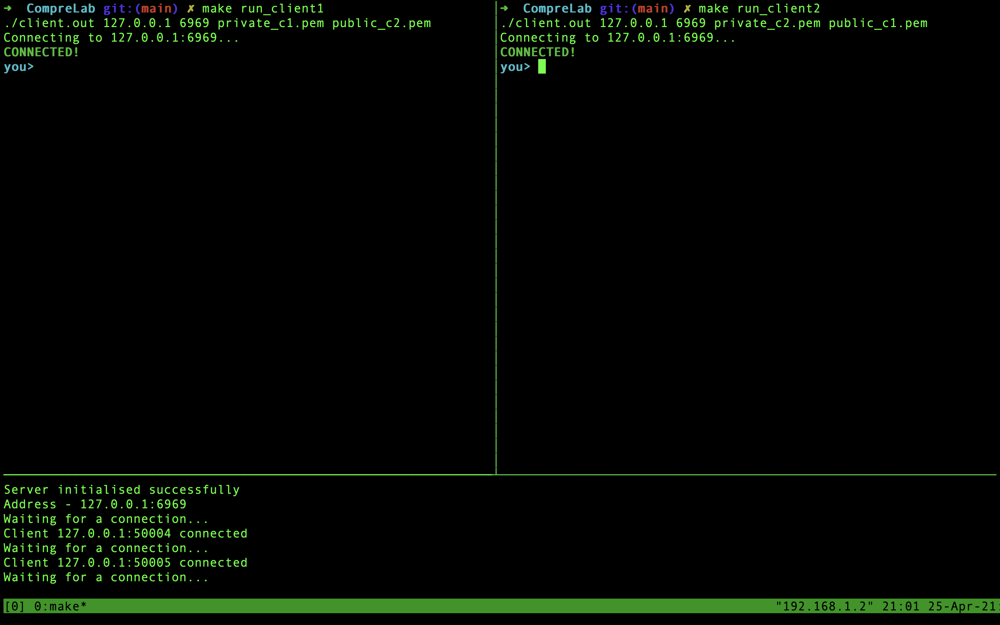
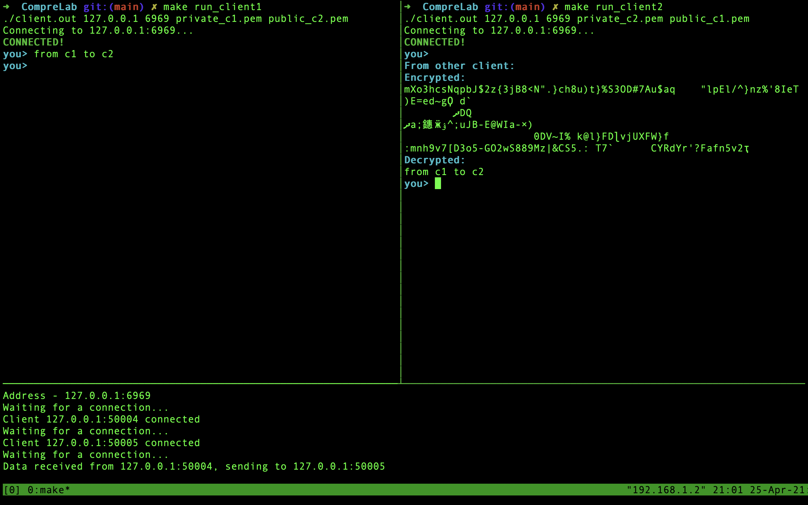
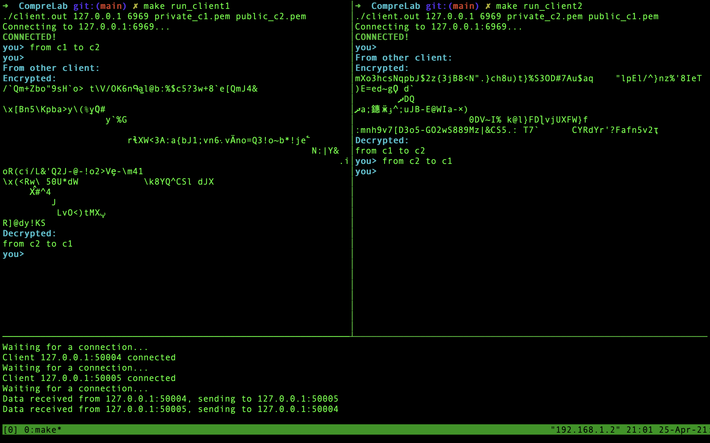
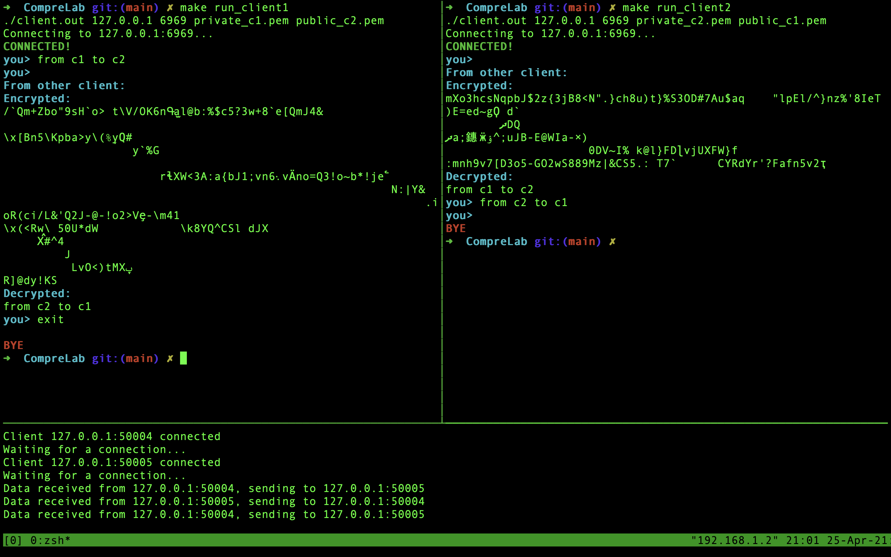
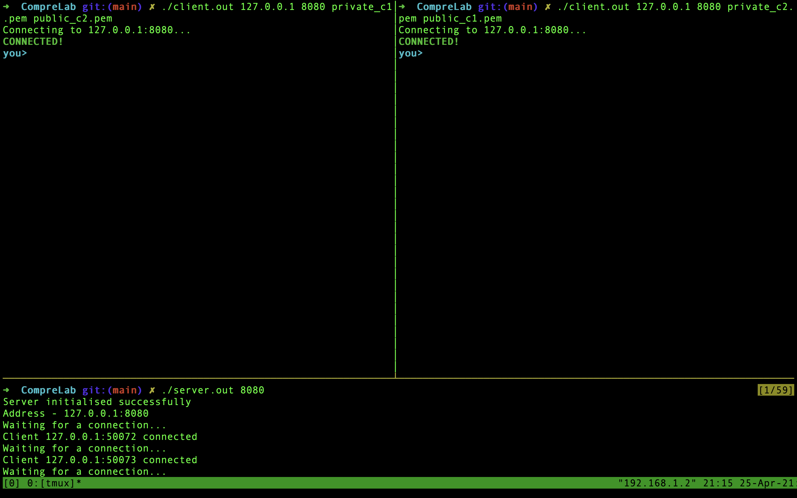

## Summary of project

The code is written in ```C``` and compiled using ```gcc``` version ```10.2.0``` and ```openssl 1.1.1k```.

## Project Structure
The following files can be seen in the project directory:

- <code>client.c</code> : Code for the client. A client connects to a specified server and sends messages to another client via the server. The message sent is encrypted with the other client's public key.
- <code>server.c</code> : Code for the server. There can be 2 connected clients at a moment. A server receives message from one client and sends it to another client.
- <code>private_c1.pem</code>,  <code>private_c2.pem</code>: Private keys that would be used to decrypt the data that is received by clients.
- <code>public_c1.pem</code>,  <code>public_c2.pem</code>: Public keys that would be used to encrypt the data that is to be sent by the client.
- <code>ss/</code>: Contains the screenshots for demo run.

## How to compile and run

Use any of the below methods to compile and run - 
### 1. Manually
<hr>

To compile:
- server.c: ```gcc server.c -lssl -lcrypto -lpthread -o server.out```
- client.c: ```gcc client.c -lssl -lcrypto -lpthread -o client.out```

To run:
- server: ```./server.out <PORT>```

for example: <code>./server.out 6969</code>

</br>

- client: <code>./client.out <server_ip> <server_port> <current_client_private_key> <other_client_public_key></code>
</br>
for example: 

1. client 1: <code>./client.out 127.0.0.1 6969 private_c1.pem public_c2.pem</code>
2. client 2: <code>./client.out 127.0.0.1 6969 private_c2.pem public_c1.pem</code>

### 2. makefile
<hr>

There are 4 main 'make' scripts: 
- <code>make compile</code> : Compiles the ```server.c``` and ```client.c``` files.
- <code>make run_server</code> : Runs the compiled server.
- <code>make run_client1</code> : Runs the compiled client with ```private_c1.pem``` and ```public_c2.pem```.
- <code>make run_client2</code> : Runs the compiled client with ```private_c2.pem``` and ```public_c1.pem```.

```make all``` or ```make``` compiles ALL the files AND runs the server ONLY. </br>

To run the code, you can - 
1. ```make``` in terminal 1.
2. ```make run_client1``` in terminal 2.
3. ```make run_client2``` in terminal 3.

<b>NOTE:</b> By default, the above ```make``` scripts will initialize the server with ```PORT = 6969```.

## Removing build files

Run <code>make clean</code> to clean and remove the build files (all the ```.out``` files).
</br></br>

# Demo run
1. Compilation. (bottom is terminal 1 or server terminal. Top left is terminal 2 or client 1 terminal. Top right is is terminal 3 or client 2 terminal.)


2. Ran all the above commands.


3. Sent a message from client 1 to client 2.


4. Sent a message from client 2 to client 1.


5. Exited from client 1.


<b>NOTE: </b>Similarly you can exit from client 2 just by typing exit in its terminal and both the clients would exit.

- A run where server and clients are accepting the arguments as specified by the question.


# Extras

- You can use ```make keys``` to make a new private key and a corresponding public key. Use ```make delete_keys``` to delete all keys. Default key size is ```4096``` bytes.

- If you try to connect a 3rd client while 2 clients are already communicating, server will reject the 3rd client and return an error.

- If client 1 is disconnected before client 2 is connected to the client, you can connect connect client 1 again and it would work.

- Server runs indefinitely accepting/rejecting clients. If you type ```exit``` in server terminal, server would exit.